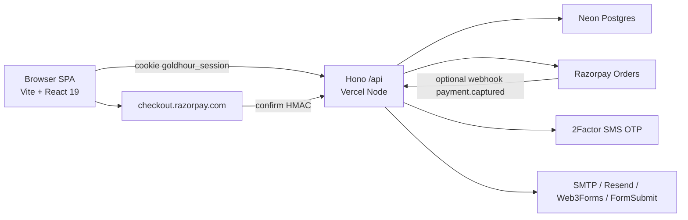
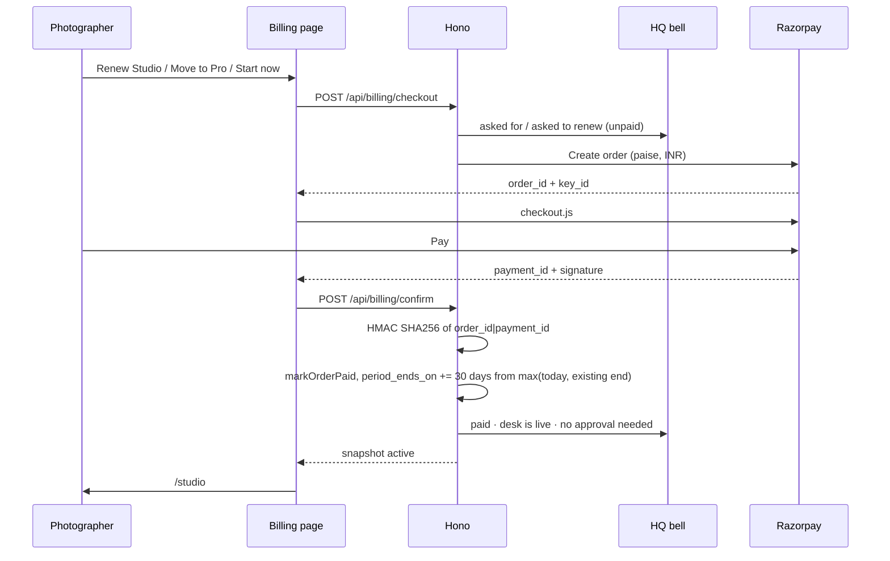

# GoldHour — complete product documentation

**Audience:** personal Confluence (operator / founder wiki)  
**Product:** GoldHour — studio desk for wedding photographers  
**Live:** https://goldhour-chi.vercel.app  
**Source:** https://github.com/kuttenajith/goldhour  
**License:** proprietary (Copyright 2026 Ajith Ka)  
**Version:** 1.1.0  
**Last updated:** 7 October 2026  

How to post this on Confluence: create a page, switch the editor to Markdown (or paste as Markdown), then save. Diagrams use Mermaid — Confluence Cloud with the Mermaid macro will render them; otherwise leave them as code blocks.

---

## 1. What GoldHour is

GoldHour is **software for wedding photographers and small studios**, not for brides. It replaces the usual mix of WhatsApp chats, Excel, notes, and UPI screenshots with one signed-in **studio desk**.

A photographer can:

1. Capture an enquiry (couple, phone, date, venue, events, budget, source).
2. Send a quotation as a branded PDF and as a WhatsApp draft.
3. Follow up on a schedule (2 days, then 5 if silent).
4. Accept the job, collect **advance / before wedding / final delivery**.
5. Run the wedding-day checklist and (on Pro) calendar, pipeline, Pulse, and a desk chatbot.

**HQ** is the operator desk (`ajithkutten1998@gmail.com`). HQ sees every studio, every lead, every payment request, and can grant, lock, restore, or export desks.

GoldHour is **not** a client portal, album proofing tool, photo storage product, or WhatsApp Business API product.

---

## 2. Who uses it

| Role | How they enter | What they get |
| --- | --- | --- |
| Wedding photographer / studio owner | `/signup` after Indian mobile OTP | 14-day trial of the full desk, then Studio ₹999 / month or Studio Pro ₹1,500 / month |
| Demo visitor | `/login` → PIN `2026` | Meenakshi Frames (Madurai) sample desk. Stays free. Cannot subscribe. |
| HQ / operator | `/login` with HQ email | `/admin` plus a personal desk. Stays free. Does not go through Razorpay. |

One human = one studio account today. There is **no team RBAC** (editor / accountant), no Google login, and no MFA.

---

## 3. Public URLs

| Path | Who | Purpose |
| --- | --- | --- |
| `/` | Anyone | Marketing landing |
| `/signup` | New studio | Create account (OTP + password) |
| `/login` | Studio / HQ / demo | Sign in |
| `/forgot` · `/reset` | Studio | Password reset |
| `/studio` | Signed-in studio with active billing | Desk home |
| `/studio/leads` · `/studio/leads/:id` | Studio | Enquiries and one wedding |
| `/studio/bookings` | Studio | Booked / accepted jobs |
| `/studio/follow-ups` | Studio | Due follow-ups |
| `/studio/quotations` | Studio | Quote list + PDF |
| `/studio/payments` | Studio | Couple money in |
| `/studio/calendar` | Pro / trial / HQ / demo | Date clashes |
| `/studio/pipeline` | Pro / trial / HQ / demo | Kanban New → Booked |
| `/studio/activity` | Pro / trial / HQ / demo | Pulse + audit |
| `/studio/billing` | Any signed-in studio | Plans, renew, upgrade (desk-locked studios land here) |
| `/admin` | HQ only | Every studio, payments, records export |

Unknown routes redirect to `/`.

---

## 4. Platform stack

| Layer | Choice | Why it is here |
| --- | --- | --- |
| Hosting | **Vercel** (Hobby) | Static Vite build + serverless Node functions. Production alias `goldhour-chi.vercel.app`. Git auto-deploy is **not** connected — production is `npx vercel@62.4.0 --prod --yes` after push. |
| Frontend | **Vite 8** + **React 19** + **TypeScript** + **React Router 7** + **Tailwind CSS 4** | SPA. CSS is utility-first with a dark “ink / gold / cream” wedding-desk look. Icons: Lucide. |
| Backend | **Hono** on Node | One `server/app.ts` mounted at `/api`. Local: `@hono/node-server` on port **8788**. Production: esbuild bundle `api/_bundle.mjs` behind Vercel Node functions. |
| Database | **Neon Postgres** (`@neondatabase/serverless`) | Production source of truth. Local fallback: `.data/goldhour.json` if `DATABASE_URL` is missing. |
| Auth | Email + password (**scrypt**), JWT cookie `goldhour_session`, Indian SMS OTP via **2Factor** | Cookie is HttpOnly, Secure on HTTPS, SameSite=Lax, 7 days. Logout and password reset revoke sessions. |
| Payments | **Razorpay Checkout.js** (orders API + HMAC confirm + optional webhook) | Test keys on Vercel today. Live keys needed before taking real money. |
| Mail | Sequential fallback: Gmail SMTP → **Resend** → Web3Forms → FormSubmit | HQ always gets a copy of studio mail except OTP codes. |
| PDF quotes | **jsPDF** in the browser | No server-side PDF worker. |
| WhatsApp | `wa.me` deep links with pre-filled Tamil/English copy | Not the WhatsApp Business API. Photographer sends from their own phone. |
| Repo / package | GitHub `kuttenajith/goldhour`, npm + optional Bun lockfile | `bunfig.toml` install cooldown 3 days. |

### 4.1 Runtime diagram



### 4.2 Local vs production

| | Local | Production |
| --- | --- | --- |
| UI | `npm run dev` → http://localhost:5173 | https://goldhour-chi.vercel.app |
| API | Vite proxies `/api` → http://127.0.0.1:8788 | Same origin `/api/*` on Vercel |
| Data | Neon if `DATABASE_URL` set, else JSON file | Neon only |
| JWT | Dev fallback secret if `JWT_SECRET` unset | `JWT_SECRET` required |
| Deploy | — | Push to GitHub `main`, then Vercel CLI 62.4.0 `--prod` (62.7.0 returned Not authorized on this account) |

---

## 5. Frontend (FE)

**Root:** `src/`  
**Entry:** `src/main.tsx` → `src/App.tsx`  
**Session:** `src/lib/store.ts` boots `GET /api/studio` on load and keeps a snapshot in memory. Desk writes `PUT /api/studio` with the whole studio blob (profile + leads + quotations). There is **no** `/api/leads/:id`.

### 5.1 Architecture rules on the client

- One signed-in **studio snapshot** is the source of UI state.
- `RequireAuth` — any signed-in user (billing page).
- `RequireStudio` — billing must be `active` (trial or paid period still valid). Otherwise redirect to `/studio/billing`.
- `RequireAdmin` — HQ email / `role: hq`.
- **Tab lock:** only one browser tab may write. Stale tabs show a guard (`src/lib/tabLock.ts`, `TabGuard`).
- **Pro gates:** Calendar, Pipeline, Pulse, Padmavathi chatbot, clash/stale/morning notices. Trial, HQ, and demo get Pro features. Paid **Studio** (₹999) does not.

### 5.2 Pages

| File | Route | Notes |
| --- | --- | --- |
| `Landing.tsx` | `/` | Marketing. Enquiry → quote → follow-up → payments → Pro extras. |
| `Signup.tsx` | `/signup` | Studio name, owner, city, 10-digit phone, OTP, email, 8+ char password. |
| `StudioLogin.tsx` | `/login` | Email/password or demo PIN. |
| `Forgot.tsx` / `Reset.tsx` | `/forgot` `/reset` | Tokenised reset. |
| `Dashboard.tsx` | `/studio` | Today’s desk: due follow-ups, money, next weddings. |
| `Leads.tsx` / `LeadDetail.tsx` | leads | Full wedding record. |
| `Bookings.tsx` | bookings | Booked / accepted. |
| `FollowUps.tsx` | follow-ups | Next-action list. |
| `Quotations.tsx` | quotations | Quotes + PDF download. |
| `Payments.tsx` | payments | Couple collections. Demo can reset sample data. |
| `Calendar.tsx` | calendar | Pro. Date-clash warnings. |
| `PipelineBoard.tsx` | pipeline | Pro. New → Booked board. |
| `Activity.tsx` | activity | Pro. Pulse (win rate, source mix, quiet quotes) + audit. |
| `Billing.tsx` | `/studio/billing` | Plans. Copy changes for trial / active / **month ended**. |
| `Admin.tsx` | `/admin` | HQ: filters, grant, soft-delete, records JSON/CSV. |

### 5.3 Important UI pieces

- **NoticeBell** — in-app inbox (studio + HQ extras). Unread toggle, sticky items.
- **Padmavathi** — local desk chatbot (`src/lib/copilot.ts`). Answers from the snapshot (and HQ overview if admin). Not an LLM API.
- **Onboarding** — first-run studio profile.
- **VisitTracker / SiteVisits** — unique-browser counter, HQ only.
- **UpgradeGate** — locked Pro screens send the photographer to billing.
- Quotes: `src/lib/pdf.ts`. WhatsApp drafts: `src/lib/whatsapp.ts`.

### 5.4 Studio data model (what the photographer edits)

Stored as JSON on the `studios` row (`leads` and `quotations` jsonb).

**Lead statuses:** `new` → `quoted` → `follow_up` → `no_response` → `accepted` → `booked` → `completed` | `lost`

**Lead sources:** Instagram, WhatsApp, referral, Google, exhibition, planner.

**Service:** photography / cinematography / both.

**Couple payments:** advance, before wedding, final delivery, extra.

Each lead can have events (engagement, mehendi, wedding, reception, …) with a timed **day-of timeline**.

---

## 6. Backend (BE)

**Root:** `server/app.ts`  
**Framework:** Hono `new Hono().basePath('/api')`  
**Production adapter:** `api/**/*.ts` re-export the esbuild bundle. Vercel catch-all files only match **one extra path segment**, so OTP is `/api/auth/otp-send` (not `/api/auth/otp/send`).

Hobby plan: keep function count low (nested `api/auth`, `api/billing`, `api/admin`, `api/studio`).

### 6.1 API catalogue

**Public / auth**

| Method | Path | Purpose |
| --- | --- | --- |
| GET | `/api/health` | Liveness |
| POST | `/api/auth/otp-send` | SMS OTP to Indian 10-digit number |
| POST | `/api/auth/otp-verify` | Check 6-digit code (10 min, 5 tries, 8s resend gap) |
| POST | `/api/auth/register` | Create studio (OTP required except HQ) |
| POST | `/api/auth/login` | Email + password |
| POST | `/api/auth/demo` | PIN `2026` |
| POST | `/api/auth/forgot` | Reset token |
| POST | `/api/auth/reset` | Consume reset token, revoke sessions |
| GET | `/api/auth/verify` | Email confirm token |
| POST | `/api/auth/logout` | Clear cookie, revoke session |

**Studio (session)**

| Method | Path | Purpose |
| --- | --- | --- |
| GET | `/api/studio` | Snapshot |
| PUT | `/api/studio` | Save profile + leads + quotes (size cap ~1.2 MB). Cannot change `userId` / studio id. |
| GET | `/api/studio/activity` | Audit for this desk |
| POST | `/api/studio/reset-demo` | Demo only |
| GET | `/api/notices` | Bell items (studio or HQ) |

**Billing**

| Method | Path | Purpose |
| --- | --- | --- |
| POST | `/api/billing/checkout` | Record requested plan, create Razorpay order, notify HQ |
| POST | `/api/billing/confirm` | Verify checkout HMAC, mark paid, auto-activate |
| POST | `/api/billing/webhook` | `payment.captured` (needs `RAZORPAY_WEBHOOK_SECRET`) |

**HQ only (403 otherwise)**

| Method | Path | Purpose |
| --- | --- | --- |
| GET | `/api/admin/overview` | Every tenant + billing + last payment |
| GET | `/api/admin/audit` | Global audit |
| POST | `/api/admin/activate-plan` | Grant Studio / Pro **without** Razorpay |
| POST | `/api/admin/remove-desk` | Soft delete (`users.deleted_at`) |
| POST | `/api/admin/restore-desk` | Clear `deleted_at` |
| GET | `/api/admin/export` | JSON snapshot (no password / OTP hashes) |

### 6.2 Server modules

| File | Responsibility |
| --- | --- |
| `server/db.ts` | Store interface: Neon **or** JSON file. `migrate()` creates tables. |
| `server/crypto.ts` | scrypt passwords, JWT secret, Razorpay HMAC, ids |
| `server/otp.ts` | 2Factor SMS only (never AUTOGEN/VOICE). Optional Fast2SMS fallback |
| `server/plans.ts` | Trial 14 days; Studio ₹999 / 30d; Pro ₹1,500 / 30d; `billingStatus()` |
| `server/notify.ts` | HQ notices for join, leads, plan request, paid |
| `server/notices.ts` | Bell composition (follow-ups, trial/period ending, expired, HQ inbox) |
| `server/noticeMail.ts` | Persist HQ inbox; sequential mail so Vercel 10s timeout does not drop the bell |
| `server/mail.ts` | Mail transport fallbacks |
| `server/validate.ts` | Email, password, lead/quote shape |
| `server/planRequests.ts` | Unpaid “asked for plan” detection |

Errors return a generic message plus `errorId` like `GH-B88A89` (never leak stack traces).

---

## 7. Database (DB)

**Production:** Neon Postgres, URL in Vercel `DATABASE_URL`.  
**Local without Neon:** `.data/goldhour.json` (gitignored).

Schema is created on first API request (`migrate()`). Extra columns use `ALTER TABLE … ADD COLUMN IF NOT EXISTS`.

### 7.1 Tables

| Table | Purpose |
| --- | --- |
| `users` | Account. `id`, `email` unique, `password_hash` (scrypt `salt:hash`), `created_at`, `email_verified_at`, `role` (`owner` \| `hq`), `deleted_at` (soft delete) |
| `studios` | One row per user. Profile fields + **`leads jsonb`** + **`quotations jsonb`** |
| `subscriptions` | `plan`, `status`, `trial_ends_on`, `period_ends_on`, `razorpay_payment_id`, `requested_plan` |
| `billing_orders` | Razorpay orders: plan, amount (paise), status `created`/`paid`, `paid_at`, payment id |
| `sessions` | Session id inside the JWT. Logout / reset sets `revoked_at` |
| `auth_attempts` | Login/signup lockout counters |
| `auth_tokens` | `verify_email` and `reset_password` (hashed) |
| `audit_events` | Desk + HQ actions |
| `phone_otps` | Hashed OTP per Indian mobile |
| `hq_inbox` | Durable HQ bell items (join, paid, plan request, …) |
| `mailed_notices` | Dedup so HQ mail is not sent twice |
| `app_settings` | Optional key/value (legacy 2Factor paste; live key is env) |

### 7.2 Isolation model

A photographer never queries another studio’s rows. The session cookie resolves **one user → one studio**. HQ lists tenants via `listTenants()`.

Soft-deleted users cannot sign in (`403`). Data stays in Postgres. HQ **Put desk back** clears `deleted_at`.

Export (`GET /api/admin/export`) includes desks, leads, quotes, Razorpay orders, activity. It **excludes** password hashes and OTP hashes. HQ downloads JSON or CSV from the Records tab.

---

## 8. Identity, signup, and sessions

### 8.1 Signup

1. Photographer enters studio name, owner, city, 10-digit Indian mobile, email, password.
2. **Send OTP** → 2Factor `POST /SMS/{phone}/{otp}/OTP1` (SMS template, not voice).
3. Code is hashed locally (`phone:code`) and stored 10 minutes.
4. After verify, **Register** creates user + empty studio + trial subscription (14 days).
5. HQ gets a **joined** bell item + mail.
6. Optional email verify link (needs Resend to hit the photographer inbox; HQ still gets a copy).

Lockout: 5 failures / 15 minutes per email; IP cap 30.

### 8.2 Session

- Cookie name: **`goldhour_session`**
- JWT HS256: `{ sub: userId, sid, demo, exp }`
- Server also stores `sid` in `sessions`. Cookie valid **and** row not revoked **and** not expired.
- New login revokes previous sessions for that user (one active session family).
- HQ email is `ajithkutten1998@gmail.com`. First HQ login can claim the HQ user.

### 8.3 Demo

PIN `2026` opens `demo@goldhour.app` with seeded couples (Priya & Arjun, Nisha, Rahul, Divya, …). Reset from Payments. Demo cannot pay.

---

## 9. Plans, trial, expiry, and payment

### 9.1 Catalogue

| Plan | Price | Period | Desk |
| --- | --- | --- | --- |
| Trial | ₹0 | 14 days from signup | Full desk **including Pro** |
| Studio | ₹999 | 30 days | Leads, quotes, PDF, follow-ups, couple payments, checklists. **No** calendar / pipeline / Pulse / Padmavathi Pro notices |
| Studio Pro | ₹1,500 | 30 days | Everything in Studio + calendar clashes, pipeline, Pulse, day-of timeline emphasis, WhatsApp templates, Padmavathi, Pro bells |
| HQ / Demo | ₹0 | Open-ended | Full desk |

### 9.2 `billingStatus` (server)

1. If `status === active` **and** `period_ends_on >= today` → **active**, desk open.
2. Else if `trial_ends_on >= today` → **trialing**, desk open.
3. Else → **expired**, `active: false`. `RequireStudio` sends them to Billing.

Leads are **not** deleted on expiry.

### 9.3 Photographer payment flow



**HQ does not approve paid desks.** Unpaid requests can still be granted from the studio card.

Renewal while still in period **extends** from the current `period_ends_on`. Renewal after expiry starts 30 days from **today**.

### 9.4 After one paid month

| Actor | What happens |
| --- | --- |
| Photographer | Desk locks. Billing headline **Your month ended**. Buttons **Renew Studio · ₹999** and **Move to Pro · ₹1,500**. Data stays. |
| 5 days before end | Studio + HQ bells: plan ending. |
| On end | HQ **Month ended** filter + sticky notice. |
| They tap Renew / Pro | HQ **Asked · unpaid** until Razorpay succeeds, then **Paid**. |
| HQ | Can grant another month without payment, or Remove desk (soft delete). |

### 9.5 Razorpay ops

| Item | Value |
| --- | --- |
| Checkout | `https://checkout.razorpay.com/v1/checkout.js` on `index.html` |
| Orders | REST `POST https://api.razorpay.com/v1/orders` with Basic auth Key ID + Secret |
| Confirm | HMAC-SHA256 `order_id|payment_id` with **key secret** |
| Webhook (optional) | `POST https://goldhour-chi.vercel.app/api/billing/webhook` event **`payment.captured`**. Secret header `x-razorpay-signature`. **Do not** use `/api/api/billing/webhook`. |
| Amounts | Integer **paise** (`99900`, `150000`) |
| Test vs live | `rzp_test_…` on Vercel now. Swap to `rzp_live_…` for real money. Never commit keys. |

Without Key ID/Secret, checkout still records an HQ **request** and tells the photographer HQ can grant the plan.

---

## 10. HQ (admin)

Route `/admin`. Filters:

- Live studios  
- Asked · unpaid  
- Paid / paying  
- Trial  
- **Month ended**  
- Removed  
- Records (JSON + desks/leads/payments CSV)  
- All including demo  

Per studio card:

- Profile, join date, trial until, paid through  
- Last Razorpay payment (plan, rupees, payment id)  
- Asked plan (unpaid)  
- **Grant Studio / Pro without payment**  
- **Remove this studio desk** / **Put desk back**  
- Every lead and quote on that desk  

HQ bell is the same feed as mail: joins, every lead/quote, unpaid asks, paid, trial ending, period ending, month ended.

Site visits (unique browsers) show on HQ only.

---

## 11. Notifications and mail

Two channels, same stories:

1. **In-app bell** (`GET /api/notices` + persisted `hq_inbox`).
2. **Email to HQ** `ajithkutten1998@gmail.com`.

Studio bells include: empty desk, new enquiry, open quote, follow-up due, advance waiting, wedding tomorrow, trial/plan ending (≤5 days), month ended, and (Pro) morning briefing, date clashes, quiet quotes.

Mail transports, in order, each with a ~4s budget (Vercel functions used to time out if four mails ran in parallel):

1. Gmail SMTP (`GMAIL_APP_PASSWORD`)  
2. Resend (`RESEND_API_KEY` + `MAIL_FROM`)  
3. Web3Forms  
4. FormSubmit  

OTP is **never** copied to HQ.

---

## 12. Security

Documented in `SECURITY.md`. In production now:

- scrypt passwords, never plaintext  
- HttpOnly session cookie  
- Session revoke on logout / reset  
- Login lockout  
- HQ-only admin routes  
- Input validation + studio size cap  
- Generic 500s with `GH-…` ids  
- Headers: nosniff, DENY framing, HSTS, limited Permissions-Policy  
- OTP hashed at rest  

**Not built (do not promise on Confluence as shipped):** Google login, MFA, team roles, Argon2id, signed photo URLs, client portal, e-sign, WhatsApp Business API, backups UI, Copilot/LLM.

Secrets live on Vercel env / `.env.local` only. Never in git.

---

## 13. Environment variables

Set on Vercel **Production** (and Preview if you test checkout there). Copy from `.env.example`.

| Variable | Required | Used for |
| --- | --- | --- |
| `DATABASE_URL` | Yes (prod) | Neon |
| `JWT_SECRET` | Yes (prod) | Session JWT |
| `APP_URL` | Recommended | Links in mail (`https://goldhour-chi.vercel.app`) |
| `RAZORPAY_KEY_ID` | For checkout | Publishable key |
| `RAZORPAY_KEY_SECRET` | For checkout | Orders + confirm HMAC |
| `RAZORPAY_WEBHOOK_SECRET` | Optional | Webhook verify |
| `TWOFACTOR_API_KEY` | For signup OTP | Indian SMS |
| `TWOFACTOR_SMS_TEMPLATE` | Optional | Default `OTP1` |
| `FAST2SMS_API_KEY` | Optional | OTP fallback |
| `GMAIL_APP_PASSWORD` | Optional | HQ SMTP |
| `RESEND_API_KEY` | Optional | Photographer + HQ mail |
| `MAIL_FROM` | With Resend | Verified from-address |
| `WEB3FORMS_ACCESS_KEY` | Optional | HQ mail fallback |
| `API_PORT` | Local only | Default 8788 |

---

## 14. How to run and ship

### Local

```bash
cd goldhour
cp .env.example .env.local
# fill DATABASE_URL / JWT_SECRET / Razorpay / 2Factor as needed
npm install
npm run dev
```

UI http://localhost:5173 · API http://127.0.0.1:8788

### Production

```bash
git push origin main
npx vercel@62.4.0 --prod --yes
```

Build: `tsc -b && vite build && copy-404 && esbuild server/app.ts → api/_bundle.mjs`.

After UI changes, hard-refresh the live site. Build stamp is the meta tag `goldhour-build` in `index.html` (current: `renew-after-month`).

---

## 15. Folder map

```
goldhour/
  src/                 React SPA
    pages/             Routes
    layout/            Auth gates + studio chrome
    components/        Bell, chatbot, forms
    lib/               Store, types, PDF, WhatsApp, Pulse
  server/              Hono API + Neon/JSON store
  api/                 Vercel function stubs + _bundle.mjs
  scripts/             copy-404, bundle-api
  public/              Favicon, photos, PWA manifest
  docs/                This document
  .data/               Local JSON DB (gitignored)
```

---

## 16. Product promises vs later phases

**Shipped and supportable**

- Multi-tenant studio accounts on Postgres  
- Indian SMS OTP signup  
- Trial → Razorpay Studio / Pro → auto-activate  
- Expiry, renew, upgrade, HQ grant  
- Soft-delete desks + records export  
- HQ bell + mail for joins, leads, payments  
- Quote PDF + WhatsApp drafts from the photographer’s phone  

**Do not list as live until built**

- Google login, MFA, invite teammates  
- WhatsApp API / template approvals  
- Client (bride) login, album proofing, photo CDN  
- E-sign contracts, GST invoices  
- Native mobile apps  
- LLM Copilot  

---

## 17. Glossary

| Term | Meaning |
| --- | --- |
| Desk | The signed-in studio app under `/studio` |
| HQ | Operator admin at `/admin` |
| Lead | One couple / wedding enquiry |
| Snapshot | JSON the UI keeps for the signed-in studio |
| Period | Paid 30-day window (`period_ends_on`) |
| Requested plan | Unpaid ask HQ sees until Razorpay or Grant |
| Soft delete | `deleted_at` set; row remains |
| Padmavathi | In-desk helper, not ChatGPT |
| Pulse | Win rate / source mix / quiet quotes (Pro) |

---

## 18. Operator checklist (handover)

1. Neon `DATABASE_URL` on Vercel Production.  
2. Strong `JWT_SECRET`.  
3. 2Factor key + DLT template `OTP1` (SMS, not voice).  
4. Razorpay **test** keys for rehearsal; **live** keys before charging studios.  
5. Webhook URL exactly `/api/billing/webhook`, event `payment.captured`.  
6. At least one mail path working (Gmail app password or Resend).  
7. HQ can sign in, see the bell, open Records, grant/remove a desk.  
8. A throwaway studio can: OTP signup → trial desk → checkout (test card) → desk live → (optional) expire → renew.  

---

*End of GoldHour product documentation. Generated from the `goldhour` codebase for a personal Confluence page. Do not paste Razorpay, 2Factor, or JWT secrets into Confluence.*
